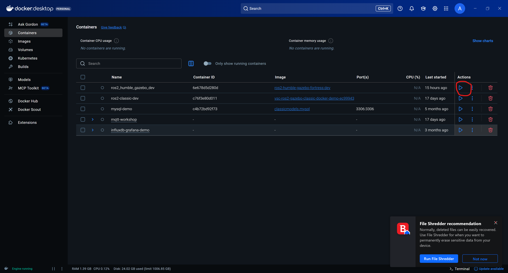
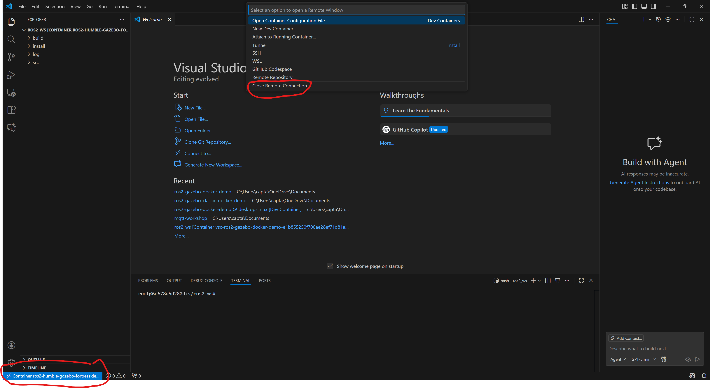

# ROS 2 Humble with Gazebo Fortress - Docker Development Environment

A complete Docker-based development environment for ROS 2 Humble with Gazebo Fortress (the new Gazebo), optimized for Windows 11 with VS Code integration.

## Prerequisites

- Windows 11
- [Docker Desktop](https://www.docker.com/products/docker-desktop/) (with WSL2 backend)
- [VcXsrv Windows X Server](https://sourceforge.net/projects/vcxsrv/)
- [Visual Studio Code](https://code.visualstudio.com/)
- VS Code Extension: [Dev Containers](https://marketplace.visualstudio.com/items?itemName=ms-vscode-remote.remote-containers)

## Features

- **ROS 2 Humble Desktop Full** - Complete ROS 2 installation
- **Gazebo Fortress** - Next-generation Gazebo simulator (formerly Ignition Gazebo)
- **ROS-Gazebo Bridge** - Seamless ROS 2 ↔ Gazebo integration
- **RViz2** - 3D visualization tool
- **Full Development Tools** - Git, CMake, GDB, Python linting/formatting
- **VS Code Integration** - Seamless development experience with IntelliSense

## Quick Start

### 1. Setup X Server (VcXsrv)

1. Launch **XLaunch** from Start menu (or install from [SourceForge](https://sourceforge.net/projects/vcxsrv/))
2. Configure settings:
   - Display: **Multiple windows**, Display number: **0**
   - Client startup: **Start no client**
   - Extra settings: **Disable access control** (Important!)
3. Click Finish
4. **Keep VcXsrv running** (you'll see it in system tray)
5. Select to save the configuration, and next time double-click to the config file in order to start automatically.

### 2. Build Docker Image
```bash
docker build -f Dockerfile.fortress -t ros2-humble-gazebo-fortress:dev .
```

### 3. Start the container
For the first time run the ps1 file (run_ros2_gazebo_dev.ps1) and start your container in the powershell. When you want to terminate its operation press CTRL+D.

The next time you can just start and stop it using the actions (play and stop) from the Docker Desktop app.


Then you can open it directly in VS code

1. Open this folder in VS Code
2. Press `F1` or `Ctrl+Shift+P`
3. Type: **"Dev Containers: Reopen in Container"**
4. Wait for container to build and start

Or select the remote explorer tab, find the container and attach it in the current window


You're now inside the container!

To close the connection, click first in the lower left button and then "close remote connection" from the main menu.
 

## Usage

### Testing the Setup

Open a terminal in VS Code and test:
```bash
# Test X server connection
xclock

# Launch RViz2
rviz2

# Launch Gazebo Fortress (GUI)
ign gazebo

# Check Gazebo version
ign gazebo --version
```

### Creating Your First Package
```bash
# Navigate to source directory
cd src

# Create a Python package
ros2 pkg create --build-type ament_python my_robot_package --dependencies rclpy

# Or create a C++ package
ros2 pkg create --build-type ament_cmake my_robot_cpp --dependencies rclcpp

# Build the workspace
cd ..
colcon build

# Source the workspace
source install/setup.bash

# Run your node
ros2 run my_robot_package my_node
```

### Working with Gazebo Fortress
```bash
# Launch empty world
ign gazebo empty.sdf

# Launch with shapes demo
ign gazebo shapes.sdf

# Launch with verbosity (debugging)
ign gazebo -v 4

# List available fuel models
ign fuel list -t model

# Launch with ROS 2 integration
ros2 launch ros_gz_sim gz_sim.launch.py

# Launch specific world with ROS 2
ros2 launch ros_gz_sim gz_sim.launch.py gz_args:="shapes.sdf"
```

### Gazebo-ROS Bridge

The `ros_gz` bridge connects Gazebo and ROS 2:
```bash
# Launch Gazebo with automatic ROS 2 bridge
ros2 launch ros_gz_sim gz_sim.launch.py

# See bridged topics
ros2 topic list

# Example: Subscribe to clock
ros2 topic echo /clock

# Create entity from ROS 2
ros2 run ros_gz_sim create -world default -file model.sdf
```

### Common Ignition Commands
```bash
# Launch Gazebo GUI
ign gazebo

# List running simulations
ign gazebo -l

# Get help
ign gazebo --help

# Launch GUI client only (connect to running server)
ign gazebo -g

# Service list
ign service -l

# Topic list
ign topic -l

# Echo a topic
ign topic -e -t /topic_name
```

### Common ROS 2 Commands
```bash
# List nodes
ros2 node list

# List topics
ros2 topic list

# Echo a topic
ros2 topic echo /topic_name

# Show topic info
ros2 topic info /topic_name

# Run rqt (graphical tools)
rqt

# View TF tree
ros2 run tf2_tools view_frames
```

## Performance Tips

- **Headless mode**: Run `ign gazebo -s` for simulation only, visualize with RViz2
- **Reduce GUI load**: Use `-g` flag to run GUI client separately
- **Optimize models**: Use simpler meshes and reduce sensor update rates
- **Allocate resources**: Docker Desktop → Settings → Resources (4GB+ RAM recommended)

## License

This project is provided as-is for educational and development purposes.

## Contributing

Feel free to submit issues and enhancement requests!